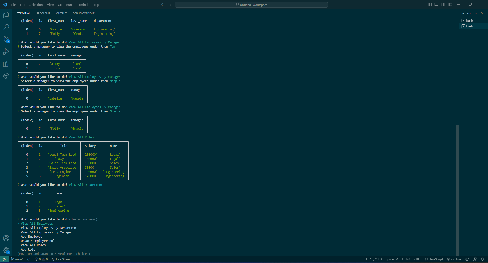

# Employee Tracker Challenge


## Table of Contents
* [Description](#description)
* [Installation](#installation)
* [Usage](#usage)
* [Demos](#demos)
* [Credits](#credits)
* [License](#license)
  
## Description

This application features an employee manager using a sql database with some CRUD components (creating, reading, and updating data). This application is interacted with using CLI and allows for users to interact and manipulte a database to manage their employees. 

## Installation

### Requires

- MYSQL
- Node.js
- NPMs:
    - Inquirer
    - Mysql2
    - Console.table
    - Figlet
    - Gradient-string

### How to Install Application

- Step 1
    - Create an empty repo (You can use a similar name to the repo you're cloning)
- Step 2
    - Copy code from [repo](https://github.com/nmatos12/employee_tracker_challenge)
    
- Step 3
    - In terminal clone the employee manager repo using the copied code
    - ``` $ git clone git@github.com:nmatos12/employee_tracker_challenge.git ```
- Step 4
    - Use the following code to change the origin's URL of your remote repository
    - ``` $ git remote set-url origin http://github.com/YOU/YOUR_REPO ```
- Step 5
    - Now you can install the npm's using the following lines of code
    - ``` $ npm init -y ```
    - ``` $ npm i ```
- Step 6 
    - You can now use the application by entering the following into your CLI
    - ``` $ node index.js or npm start (If you made that start script in your package.json) ```

## Usage

JavaScript, Markdown, and MYSQL

## Demos

Links below provide a functionality of webpage.

[Screencastify Demo](https://watch.screencastify.com/)

[MP4 Download Demo](Develop/assets/videos/)




## Credits

Rutger University: https://git.bootcampcontent.com/Rutgers-University/RUT-VIRT-FSF-FT-02-2023-U-LOLC

### References:
- [Digital Ocean Inquirer Documentation](https://www.digitalocean.com/community/tutorials/nodejs-interactive-command-line-prompts)
- [Instuctor Videos: JD Tadlock](https://gist.github.com/jdtdesigns/9cfe05400063902e46aa5f6faabff0ca)
- [Coding Video where that used figlet](https://www.youtube.com/watch?v=_oHByo8tiEY)
- [Figlet NPM Documentation](https://www.npmjs.com/package/figlet)
- [MYSQL2 NPM Documentation](https://www.npmjs.com/package/mysql2)
- [SQL Cheatsheet from Freecodecamp](https://www.freecodecamp.org/news/learn-sql-in-10-minutes/)

## License

MIT License

Copyright (c) [2023] [Matos,Natalie]

Permission is hereby granted, free of charge, to any person obtaining a copy
of this software and associated documentation files (the "Software"), to deal
in the Software without restriction, including without limitation the rights
to use, copy, modify, merge, publish, distribute, sublicense, and/or sell
copies of the Software, and to permit persons to whom the Software is
furnished to do so, subject to the following conditions:

The above copyright notice and this permission notice shall be included in all
copies or substantial portions of the Software.

THE SOFTWARE IS PROVIDED "AS IS", WITHOUT WARRANTY OF ANY KIND, EXPRESS OR
IMPLIED, INCLUDING BUT NOT LIMITED TO THE WARRANTIES OF MERCHANTABILITY,
FITNESS FOR A PARTICULAR PURPOSE AND NONINFRINGEMENT. IN NO EVENT SHALL THE
AUTHORS OR COPYRIGHT HOLDERS BE LIABLE FOR ANY CLAIM, DAMAGES OR OTHER
LIABILITY, WHETHER IN AN ACTION OF CONTRACT, TORT OR OTHERWISE, ARISING FROM,
OUT OF OR IN CONNECTION WITH THE SOFTWARE OR THE USE OR OTHER DEALINGS IN THE
SOFTWARE.
